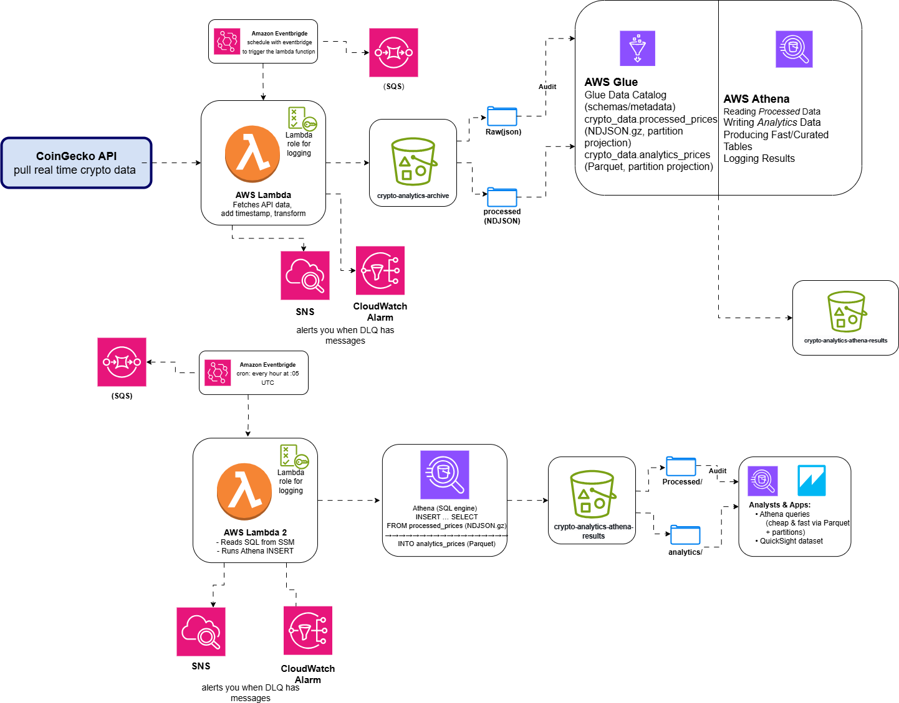
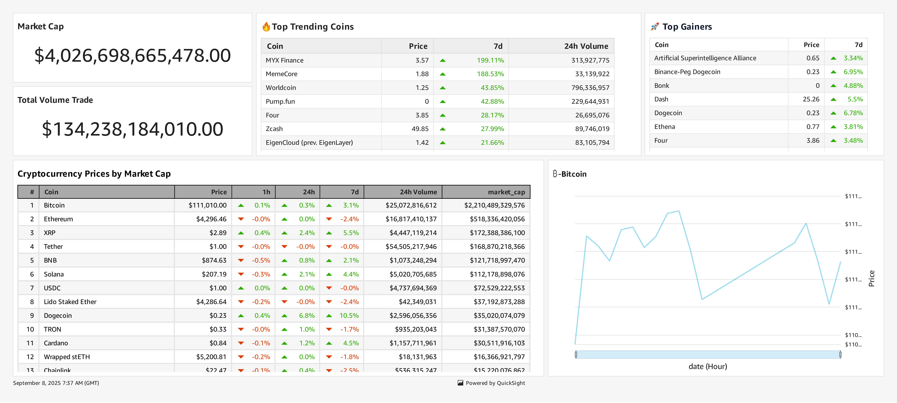

# **Real-Time Cryptocurrency Analytics Pipeline Project**


- **Architecture Diagram**
  

- **QuickSight Dashboard**
  

---

## **Summary**

This project delivers a production-style ETL pipeline that transforms live cryptocurrency market feeds into an analytics-ready data lake and interactive dashboards. Through a staged process of ingestion, transformation, and visualization, raw API snapshots are organized into curated Parquet datasets and exposed through Athena and QuickSight for real-time insights.

The solution was designed to answer common market intelligence questions like:

- What is the current total market cap, and how has it moved today?  
- Which coins gained the most in the last 24 hours?  
- Which assets are trending over the past week?  
- Who ranks in the top 100 by market cap, with price, percentage changes, and trading volume?  
- How did Bitcoin’s price evolve over the last 24 hours?  

By addressing these questions with a reliable dataset and self-serve dashboards, the project mirrors a real production ETL system: raw data is ingested continuously, transformed into optimized storage for fast queries, and surfaced as consistent, easy-to-use metrics and visualizations.

## **Project Background**

Cryptocurrency has evolved into one of the most **dynamic financial markets** in the world, with thousands of assets trading across dozens of exchanges.  
Unlike traditional equities, crypto runs **24/7** with extreme volatility, making **timely data and analytics** crucial for traders, analysts, and researchers.

Most public APIs (like CoinGecko) only provide **point-in-time snapshots**. While useful for a quick look, they are not designed for:

- Tracking **historical changes** at scale.  
- Answering time-series questions (e.g., “What was the top 100 list 12 hours ago?”).  
- Supporting dashboards or BI tools that need **partitioned, analytics-ready data**.  
- Efficient querying across large datasets without scanning raw JSON repeatedly.  

---

### 💡 The Problem
- **Raw API data** is not suitable for direct analytics.  
- **Lack of history** makes trend analysis difficult.  
- **JSON format** is inefficient and costly to query at scale.  
- **Unreliable ingestion** (API rate limits, transient failures) can lead to data loss.  
- **No monitoring/alerting** to ensure data freshness.  

---

### 🌟 Why This Project?
This project was designed to **mirror a production-grade ETL pipeline**, showing how raw streaming data can be transformed into **analytics-ready datasets and dashboards** using AWS services.

It demonstrates how to:
- **Continuously ingest** real-time crypto data (every 5 minutes).  
- **Transform & partition** it into efficient columnar storage (Parquet).  
- **Serve** the data with SQL engines (Athena) and BI dashboards (QuickSight).  
- **Monitor & recover** automatically when failures occur (DLQ, CloudWatch, SNS).  

--------------------------------------------------------

### 🏆 Impact
By building this pipeline, we bridge the gap between **raw crypto APIs** and **business-ready insights**.  
It provides:
- A **data lake** for long-term historical storage.  
- **Fast queries** with Athena + Glue Catalog.  
- **Interactive dashboards** in QuickSight (market cap, top gainers, volume, trends).  
- A demonstration of **real-world ETL and reliability patterns** in the cloud.  

---

## **Technical Solution**

---

## 🟢 Phase 1 — Extraction (Summary)

**Goal:**  
Fetch real-time cryptocurrency market data every 5 minutes from the CoinGecko API and store it in AWS S3, both as raw API responses and as processed, query-ready snapshots.

**Deliverables:**  
- **AWS Lambda** function (`fetchCryptoPrices`) triggered by **EventBridge** (every 5 minutes).  
- **S3 Archive Bucket** (`crypto-analytics-archive-fortune`) with two zones:  
  - `raw/` → exact API JSON responses.  
  - `processed/` → NDJSON.gz files partitioned by `year/month/day/hour`.  
- **Logging & Reliability**: CloudWatch logs for observability and optional SQS DLQ for failed events.  
- **Security & Hardening**: Block Public Access, SSE-S3 encryption, versioning, and tagging enabled.

**Schema Highlights (processed):**  
Each row includes:
- `id`, `symbol`, `name`
- `current_price`, `market_cap`, `market_cap_rank`
- `volume_24h`, `price_change_pct_1h`, `price_change_pct_24h`, `price_change_pct_7d`
- `timestamp`, `year`, `month`, `day`, `hour`

**IAM (Least Privilege):**  
- Lambda can write only to `raw/` and `processed/` prefixes.  
- Minimal S3 read/list permissions.  
- CloudWatch logging enabled.  

**Validation:**  
1. Deploy via Terraform.  
2. Manually invoke Lambda or let EventBridge trigger automatically.  
3. Confirm objects appear in S3 (`raw/` and `processed/`).  
4. Athena (Phase 2) queries will show ~250 coins × snapshots per hour.

---

## 🔵 Phase 2 — Data Lake & Query Layer (Summary)

**Goal:**  
Organize and register processed data in an **AWS Data Lake** so it can be queried efficiently with Athena. This phase transforms raw snapshots into a structured, partitioned, analytics-ready format.

**Deliverables:**  
- **S3 Data Lake Buckets**  
  - `crypto-analytics-archive-fortune/processed/` → NDJSON.gz (hourly partitions).  
  - `crypto-analytics-athena-results/analytics/` → Parquet (analytics-ready).  

- **AWS Glue Data Catalog**  
  - Database: `crypto_data`.  
  - Tables:  
    - `processed_prices_raw` → JSON, schema-on-read (all strings).  
    - `processed_prices` → typed schema for NDJSON.gz.  
    - `analytics_prices` → Parquet, partitioned by `year/month/day/hour`.  

- **Partition Projection**  
  - Eliminates the need for `MSCK REPAIR TABLE` or manual partition updates.  
  - Supports direct partition pruning in Athena queries.

**Schema Highlights:**  
- **Processed Tables (NDJSON):** flexible ingestion, tolerant to schema drift.  
- **Analytics Tables (Parquet):** optimized for query performance and cost.  

**IAM & Security:**  
- Glue and Athena roles restricted to only the necessary S3 prefixes (`processed/` and `analytics/`).  
- Query results centralized in `s3://crypto-analytics-athena-results/query-results/`.  
- S3 buckets hardened with SSE-S3 encryption, versioning, and Block Public Access.  

**Validation:**  
1. Run Athena queries against `processed_prices_raw` to confirm ~250 coins per snapshot.  
2. Use `SELECT DISTINCT year, month, day, hour FROM processed_prices` to confirm partitions resolve correctly.  
3. Verify `analytics_prices` appears in Glue and can be queried once Phase 3 begins materializing data.

---
---

## 📦 Transformed Data Format (Analytics Layer)

**Location:**  
`s3://crypto-analytics-athena-results/analytics/year=YYYY/month=MM/day=DD/hour=HH/*.parquet`

**Table:**  
`crypto_data.analytics_prices` (AWS Glue Data Catalog)

---

### Columns (Typed Schema)
| Column                | Type    | Description                                    |
|------------------------|---------|------------------------------------------------|
| `id`                  | string  | Unique CoinGecko identifier (e.g., `bitcoin`) |
| `symbol`              | string  | Trading symbol (e.g., `btc`)                  |
| `name`                | string  | Full coin name (e.g., `Bitcoin`)              |
| `current_price`       | double  | Spot price in USD                             |
| `market_cap`          | bigint  | Market capitalization (USD)                   |
| `market_cap_rank`     | int     | Rank by market cap (1 = largest)              |
| `volume_24h`          | bigint  | Reported 24-hour trading volume (USD)         |
| `price_change_pct_1h` | double  | Percentage change in last 1h                  |
| `price_change_pct_24h`| double  | Percentage change in last 24h                 |
| `price_change_pct_7d` | double  | Percentage change in last 7d                  |
| `timestamp`           | bigint  | Epoch time (seconds) when snapshot was taken  |

---

### Partitions
| Partition Key | Type | Notes                              |
|---------------|------|------------------------------------|
| `year`        | int  | UTC year of snapshot               |
| `month`       | int  | UTC month (01–12)                  |
| `day`         | int  | UTC day of month (01–31)           |
| `hour`        | int  | UTC hour (00–23)                   |

---

### Why Parquet?
- **Columnar format**: queries only scan needed fields → lower cost  
- **Partition pruning**: Athena queries only the relevant hour/day, not the whole dataset  
- **Compression (GZIP)**: smaller storage footprint, faster scans  

---

### Example Athena Query
```sql
-- Get top 10 coins by market cap in the latest snapshot
WITH latest AS (
  SELECT year, month, day, hour
  FROM crypto_data.analytics_prices
  GROUP BY 1,2,3,4
  ORDER BY year DESC, month DESC, day DESC, hour DESC
  LIMIT 1
)
SELECT id, symbol, name, current_price, market_cap, volume_24h
FROM crypto_data.analytics_prices a
JOIN latest l
  ON a.year=l.year AND a.month=l.month AND a.day=l.day AND a.hour=l.hour
ORDER BY market_cap DESC
LIMIT 10;
```
---

## 🟣 Phase 3 — Transformation & Materialization (Summary)

**Goal:**  
Convert the ingested snapshots into an **analytics-ready Parquet layer**, keeping every 5-minute observation while avoiding duplicate inserts, so downstream queries and dashboards are fast, reliable, and cost-effective.

---

### Deliverables
- **Lambda Function:** `updateAnalyticsHourly`  
  - Triggered hourly by **EventBridge** (`cron(5 * * * ? *)` → runs at :05 UTC).  
  - Reads parameterized SQL from **SSM Parameter Store** (`/crypto-analytics/sql/insert_last_hour`).  
  - Executes Athena `INSERT … SELECT` to load new data into the `analytics/` folder (Parquet).  
  - Logs query execution IDs for traceability.

- **S3 Analytics Bucket:** `crypto-analytics-athena-results/analytics/`  
  - Stores partitioned Parquet files.  
  - Organized as `year=YYYY/month=MM/day=DD/hour=HH/`.  

- **Glue Table:** `crypto_data.analytics_prices`  
  - Partitioned schema registered in Glue Catalog.  
  - Supports partition projection for automatic discovery.  

- **SQL Template:** `insert_last_hour.sql`  
  - Ensures type safety with `TRY_CAST`.  
  - Uses `LEFT JOIN … IS NULL` to avoid re-inserting the same snapshot.  
  - Runs only for the **last completed hour**.

---

### How It Works
1. **Trigger**: EventBridge fires at the start of each new hour.  
2. **SQL Retrieval**: Lambda fetches the `INSERT` template from Parameter Store.  
3. **Athena Execution**: Lambda submits the SQL with `${year,month,day,hour}` filled in.  
4. **Write Path**: Athena writes Parquet output to `analytics/` partition.  
5. **Deduplication**: The join logic ensures each snapshot is only inserted once.  
6. **Logging**: Query execution ID + partition loaded are pushed to CloudWatch.  

---

### IAM & Security
- Lambda role includes:  
  - `athena:StartQueryExecution`, `athena:GetQueryExecution`, `athena:GetQueryResults`.  
  - `ssm:GetParameter` for SQL templates.  
  - `s3:GetObject` on `processed/`, `s3:PutObject` on `analytics/`, `s3:PutObject/GetObject/DeleteObject` on `query-results/`.  
  - Glue permissions to `GetTable` and `CreatePartition`.  
- Results bucket (`query-results/`) hardened with bucket policies and owned by the account.

---

### Validation
1. Run Lambda manually or wait for hourly trigger.  
2. Check CloudWatch logs → should show `ok: true` and the `query_id`.  
3. Verify new files in S3 under `analytics/year=YYYY/month=MM/day=DD/hour=HH/`.  
4. Run Athena query:

   ```sql
   SELECT COUNT(DISTINCT id) AS coins, COUNT(*) AS rows
   FROM crypto_data.analytics_prices
   WHERE year=2025 AND month=9 AND day=8 AND hour=2;

---

## 🟠 Phase 4 — Outputs & Consumption (Summary)

**Goal:**  
Make the transformed Parquet data easily accessible to analysts, dashboards, and applications for **business-ready insights**.

---

### Deliverables
- **Athena SQL Views** (curated for common use cases):  
  - `v_latest_partition` → most recent partition metadata  
  - `v_latest_snapshot` → latest hour's snapshot across all coins  
  - `v_market_cap` → coins ranked by market cap  
  - `v_top_100` → top 100 coins with prices, ranks, and changes  
  - `v_top_gainers` → coins with highest 24h % change  
  - `v_total_market_cap` → global market cap sum  
  - `v_trending` → top movers over the last 7 days  
  - `v_trendline_core` → BTC, ETH, USDT, SOL hourly prices (7 days)  
  - `v_volume_24h` → ranked 24h trading volume  

- **QuickSight Dashboards** (visuals built on top of Athena views):  
  - KPI Cards: Total Market Cap, Total 24h Volume  
  - Tables: Top 100 coins (prices, % changes, volumes, ranks)  
  - Charts: Top Gainers, Trending Coins  
  - Line Graphs:  
    - Bitcoin 24h price trend (+ volume + % change)  
    - Multi-coin 7-day trends for BTC, ETH, USDT, SOL  

---

### IAM & Security
- **QuickSight service role** granted:  
  - `s3:ListBucket`, `s3:GetBucketLocation` on analytics/results buckets  
  - `s3:GetObject` on `analytics/` Parquet data  
  - `s3:PutObject/GetObject/DeleteObject` on `query-results/`  
- Access scoped only to Athena results bucket (`crypto-analytics-athena-results`)  

---

### Validation
1. In Athena: run `SELECT * FROM v_latest_snapshot LIMIT 10;` to confirm data is fresh  
2. In QuickSight:  
   - Verify the Athena data source connection is valid  
   - Confirm rows are imported from each view  
   - Build or refresh dashboards on top of `crypto_data` views  

---

### Why It Matters
- Provides **ready-made insights** (no need to write raw queries)  
- Dashboards update **hourly** in sync with the pipeline  
- Enables both **technical analysts** (via Athena SQL) and **business users** (via QuickSight) to use the same governed dataset  
- Queries are **fast and cost-effective** thanks to Parquet + partition pruning  

---
---

## ⚙️ Implementation Process

The project was implemented step by step, mirroring how production data pipelines are designed and deployed. Each phase builds on the previous one.

---

### 1. Infrastructure Setup
- Defined infrastructure as code (IaC) using **Terraform**  
- Provisioned:
  - **S3 buckets** (`archive`, `analytics`, `query-results`) with encryption, versioning, and block public access  
  - **IAM roles & policies** with least-privilege design for Lambda, Athena, QuickSight  
  - **Glue Data Catalog** database (`crypto_data`) and tables  
  - **EventBridge schedules** for periodic Lambda invocations  

---

### 2. Phase 1 – Extraction
- Developed the `fetchCryptoPrices` **Lambda** in Python  
- Integrated **CoinGecko API** with retries/backoff and deduplication  
- Scheduled Lambda via EventBridge (`rate(5 minutes)`)  
- Wrote data into S3:
  - `raw/` → full JSON payloads for audit/replay  
  - `processed/` → compressed NDJSON.gz, partitioned by `year/month/day/hour`  
- Validated by:
  - Inspecting S3 objects  
  - Checking CloudWatch logs for successful runs and coin counts  

---

### 3. Phase 2 – Data Lake & Query Layer
- Registered `processed_prices_raw` and `processed_prices` tables in **Glue Catalog**  
- Enabled **partition projection** to avoid manual partition management  
- Queried processed data with **Athena** to confirm ~250 coins per snapshot  
- Created `analytics_prices` table pointing to Parquet layer (to be populated in Phase 3)  

---

### 4. Phase 3 – Transformation & Materialization
- Built `updateAnalyticsHourly` **Lambda** triggered by EventBridge (`cron(5 * * * ? *)`)  
- Stored reusable `insert_last_hour.sql` in **SSM Parameter Store**  
- Lambda orchestrates **Athena INSERT queries**:
  - Reads processed NDJSON.gz  
  - Casts/validates types with `TRY_CAST`  
  - Writes deduplicated snapshots into **analytics/** (Parquet)  
- Verified by:
  - CloudWatch logs showing query execution IDs  
  - Checking S3 `analytics/` partitions  
  - Querying Athena (`SELECT COUNT(DISTINCT id)` per hour)  

---

### 5. Phase 4 – Outputs & Consumption
- Defined curated **Athena Views** (`v_latest_snapshot`, `v_top_100`, `v_trending`, etc.)  
- Connected **QuickSight** to Athena Workgroup  
- Built dashboards:
  - Global KPIs (market cap, volume)  
  - Top 100 coins table  
  - Trendline charts for BTC, ETH, USDT, SOL  
- Scheduled QuickSight SPICE refresh hourly to align with pipeline cadence  

---

### 6. Reliability & Monitoring
- Attached **SQS DLQs** to EventBridge→Lambda for failed events  
- Used **CloudWatch Logs** for all Lambda executions  
- Configured **CloudWatch Alarms + SNS**:
  - Trigger if DLQ > 0 messages  
  - Trigger if Lambda error count spikes  
- Recovery playbook: inspect DLQ, reprocess failed events, or manually rerun SQL for missing partitions  

---

### 7. Validation & Testing
- **Unit validation**: S3 objects contain expected keys and counts  
- **Integration validation**: Athena queries return ~250 distinct coins per snapshot  
- **End-to-end validation**: Dashboards refresh with new data each hour  
- **Failure testing**: Simulated CoinGecko API failure → verified DLQ capture and alerting  

---

### 8. Final Deliverables
- Terraform IaC definitions  
- Python Lambdas (`fetchCryptoPrices.py`, `updateAnalytics.py`)  
- Glue Catalog schemas and Athena SQL views  
- QuickSight dashboards  
- Documentation (README + diagrams)  

---
---

## 🛠 Tools & Technologies 

- **Infrastructure:** Terraform (IaC) to provision S3, IAM, Glue, Athena, Lambda, EventBridge  
- **Extraction:** Lambda (Python) + EventBridge to fetch CoinGecko data every 5 min → S3 (`raw/`, `processed/`)  
- **Data Lake:** S3 analytics bucket (Parquet), Glue Data Catalog for schemas, partition projection for efficiency  
- **Transformation:** Lambda + Athena (hourly `INSERT … SELECT`), SQL templates stored in SSM Parameter Store  
- **Consumption:** Athena SQL views + QuickSight dashboards (market cap, 24h volume, top gainers, trends)  
- **Security & Reliability:** IAM least privilege, CloudWatch logs/alarms, SQS DLQs, SSE-S3 encryption, bucket versioning  
- **Development:** Python (`boto3`, `urllib3`, `gzip`, `json`), AWS CLI for testing, Athena queries for validation  

---

---

## ⚡ Challenges & Solutions

**1. Handling API limits & duplicates**  
- *Challenge:* CoinGecko API sometimes returns duplicates or fails with `429 Too Many Requests`  
- *Solution:* Added retry logic with exponential backoff and deduplication by `id` inside the Lambda  

**2. Storing large volumes of JSON efficiently**  
- *Challenge:* Raw JSON is slow and costly to query in Athena  
- *Solution:* Wrote **processed NDJSON.gz** for ingestion, then converted to **Parquet** with hourly Lambda materialization  

**3. Schema drift & type errors**  
- *Challenge:* Athena threw `HIVE_BAD_DATA` when numeric fields (e.g., `market_cap`) appeared as strings  
- *Solution:* Created a `processed_prices_raw` table with **all strings**, then casted fields safely with `TRY_CAST` during transformation  

**4. Partition management**  
- *Challenge:* Manual partition updates (`MSCK REPAIR`) don't scale  
- *Solution:* Enabled **partition projection** in Glue Catalog to auto-discover partitions without manual updates  

**5. IAM access errors**  
- *Challenge:* Athena queries failed with "Access Denied" on S3 and Glue  
- *Solution:* Iteratively refined IAM policies to follow **least privilege**, adding explicit permissions for Athena query results, Glue partitions, and analytics S3 prefixes  

**6. QuickSight integration**  
- *Challenge:* QuickSight initially couldn't read Athena results due to missing bucket policies  
- *Solution:* Attached S3 bucket policy granting the QuickSight role `ListBucket`, `GetBucketLocation`, and `GetObject` on analytics and results prefixes  

**7. Reliability & Monitoring**  
- *Challenge:* Failures could silently drop data or break the pipeline  
- *Solution:* Added **SQS DLQs** for EventBridge → Lambda, **CloudWatch Logs** for every function, and **SNS Alarms** for DLQ/message monitoring  

---

### ✅ Outcome
By solving these challenges, the pipeline is now:  
- **Resilient** (handles API errors, failures go to DLQ)  
- **Efficient** (Parquet + partition pruning lowers query cost)  
- **Secure** (least-privilege IAM, encrypted S3, block public access)  
- **Business-ready** (Athena views + QuickSight dashboards for real insights)  

---


